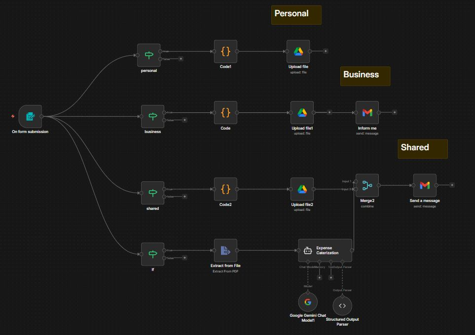
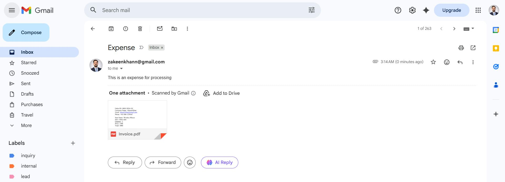
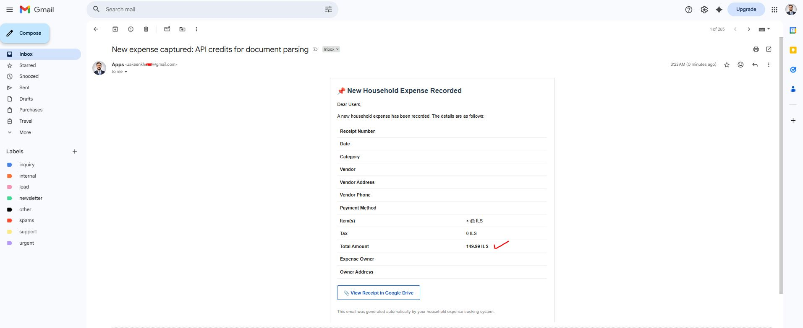
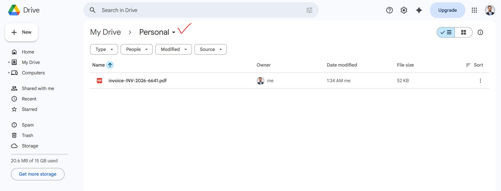

# Expense Categorization Automation

## Overview

This N8N workflow automates expense categorization using AI. It captures expense data through a form, extracts receipt information with OCR, categorizes expenses using Google Gemini AI, and routes them to appropriate Google Drive folders based on category (Personal, Business, or Shared/Home).

## How It Works

### The Approach

1. **Form Submission**: Users fill out a simple form with expense details including description, category, billing period, vendor location, and receipt upload
2. **Smart Routing**: The workflow automatically routes expenses based on selected category
3. **AI-Powered Extraction**: Google Gemini AI extracts and structures data from receipt images using OCR
4. **Automated Filing**: Expenses are automatically uploaded to the correct Google Drive folder
5. **Notifications**: Business expenses trigger email notifications for tracking

### Key Nodes

- **On Form Submission**: Trigger node that captures expense data via a user-friendly form
- **Personal/Business/Shared IF Nodes**: Route expenses to different processing paths based on category selection
- **Extract from File**: OCR node that extracts text from receipt PDFs/images
- **Google Gemini Chat Model**: AI model that processes extracted text and categorizes expense details
- **Expense Categorization Agent**: LangChain agent that structures the data into clean JSON format
- **Code Nodes (Code/Code1/Code2)**: Custom JavaScript that prepares data for each category's Google Drive folder
- **Upload File Nodes**: Upload processed expenses to respective Google Drive folders
- **Merge & Send Message**: Combines data and sends a Slack message with expense summary
- **Inform Me (Gmail)**: Sends email notification for business expenses with receipt attachment

## Workflow Screenshots

### Expense Information Form

### Home/Shared Category Processing

### Personal Category Processing

## ROI & Benefits

### Time Savings
- **Manual categorization eliminated**: No more sorting receipts by hand
- **Data entry automated**: OCR extracts amounts, dates, and vendors automatically
- **Filing automated**: Expenses go directly to the right folder

### Accuracy
- **AI-powered extraction**: Reduces human error in data entry
- **Consistent categorization**: Same rules applied every time
- **Structured data**: Clean, machine-readable JSON output

### Human Benefits
- **Less paperwork**: Spend minutes instead of hours on expense tracking
- **Better organization**: All expenses automatically sorted and stored
- **Easy retrieval**: Find any expense quickly in organized Drive folders
- **Peace of mind**: Business expenses flagged with email notifications
- **Scalability**: Handles any volume of expenses without additional effort

### Use Cases
- Freelancers tracking business vs personal expenses
- Families managing shared household expenses
- Small businesses automating expense reporting
- Anyone wanting to eliminate manual receipt management
